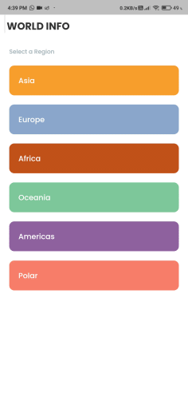

## World Info
### A General Knowledge to World!

<div><br></div>

---

<div><br></div>

## Table of Contents
1.  About
1.  Built With
1.  Screenshots
1.  Try it Yourself 
1.  How can you use it ?
    - Prerequisites
    - Usage
1. Contact


# About
#### This app uses Countries API and display information continent wise and then renders down to countries and then their details with use of beautiful colors It also has search feature implemented to search through hoard of countries.

API Used : [Countries API]("https://restcountries.eu/)

<div><br><br></div>

# Built With
#### This application is built using Flutter and Dart which is an underlying language which Flutter requires.

<div align="center" display="block">
<br>


</div>

<br><br></div>

# Screenshots
### Here is how the app looks like

<br><br>


# Try it Yourself
### You can try this app by installing it on your device. Here is the link for the app to download -> [Click here to Download!](https://drive.google.com/file/d/1uxswBDig8Es9xK20Jatjo2Vjy_ZTL3OM/view?usp=sharing)
<br><br>

# How can you use it ?
#### You need to follow this simple steps to execute this application locally on your machine

## Prerequisites
1. Flutter SDK must be installed -> [How to do it ?](https://flutter.dev/docs/get-started/install)
1. Basic knowledge of Flutter & Android


## Usage
1. Clone the project by command
    ```
        git clone https://github.com/mayurnile/world_info
    ```
1.  Execute the app!

<div><br><br></div>

# Contact
Mayur Nile - [Linkedin](https://www.linkedin.com/in/mayurnile/) - mayurnile95@gmail.com

Project Link: [https://github.com/mayurnile/world_info](https://github.com/mayurnile/world_info)